## Visualizing Data

### Getting Started

Data visualization is a powerful tool in the field of data science that
helps to communicate complex data insights in an intuitive and
easy-to-understand way. R is a popular programming language and
environment for statistical computing and graphics that provides a wide
range of tools and packages for creating high-quality visualizations.


R offers several different approaches to data visualization, each with
its own strengths and weaknesses. Here are some of the most common
approaches:

**Base:** R’s base graphics system is built-in and provides basic
functionality for creating a range of plots, including scatterplots,
line charts, and histograms. While it’s easy to use and flexible, it
lacks some of the advanced features of more modern graphics packages.

**Lattice:** Lattice is another popular data visualization package that
provides a high-level interface for creating complex plots. It’s
particularly useful for creating trellis plots, which allow users to
visualize relationships between multiple variables at once.

**ggplot2:** ggplot2 is a popular data visualization package that
provides a more powerful and flexible approach to data visualization
than base graphics. ggplot2 uses a “grammar of graphics” approach,
allowing users to build plots by adding layers of graphical elements,
such as points, lines, and labels. This makes it easy to create complex
visualizations.

In this course, we will focus on `ggplot2`, as it provides us with a
highly systematic grammar to create complex visualizations in a flexible
manner.

### Diamonds

The journey of every visualization begins with the data. We will use the
`diamonds` dataset that ships with the `ggplot2` package to explore the
amazing world of data visualization!


Let us start by printing the data to take a look at what it holds.

``` r
library(tidyverse)
#> ── Attaching core tidyverse packages ──────────────────────── tidyverse 2.0.0 ──
#> ✔ dplyr     1.1.2     ✔ readr     2.1.4
#> ✔ forcats   1.0.0     ✔ stringr   1.5.0
#> ✔ ggplot2   3.4.2     ✔ tibble    3.2.1
#> ✔ lubridate 1.9.2     ✔ tidyr     1.3.0
#> ✔ purrr     1.0.1     
#> ── Conflicts ────────────────────────────────────────── tidyverse_conflicts() ──
#> ✖ dplyr::filter() masks stats::filter()
#> ✖ dplyr::lag()    masks stats::lag()
#> ℹ Use the conflicted package (<http://conflicted.r-lib.org/>) to force all conflicts to become errors
# We filter out large diamonds so the plots look nicer!
diamonds <- diamonds |> filter(carat <= 3)
diamonds
#> # A tibble: 53,908 × 10
#>    carat cut       color clarity depth table price     x     y     z
#>    <dbl> <ord>     <ord> <ord>   <dbl> <dbl> <int> <dbl> <dbl> <dbl>
#>  1  0.23 Ideal     E     SI2      61.5    55   326  3.95  3.98  2.43
#>  2  0.21 Premium   E     SI1      59.8    61   326  3.89  3.84  2.31
#>  3  0.23 Good      E     VS1      56.9    65   327  4.05  4.07  2.31
#>  4  0.29 Premium   I     VS2      62.4    58   334  4.2   4.23  2.63
#>  5  0.31 Good      J     SI2      63.3    58   335  4.34  4.35  2.75
#>  6  0.24 Very Good J     VVS2     62.8    57   336  3.94  3.96  2.48
#>  7  0.24 Very Good I     VVS1     62.3    57   336  3.95  3.98  2.47
#>  8  0.26 Very Good H     SI1      61.9    55   337  4.07  4.11  2.53
#>  9  0.22 Fair      E     VS2      65.1    61   337  3.87  3.78  2.49
#> 10  0.23 Very Good H     VS1      59.4    61   338  4     4.05  2.39
#> # ℹ 53,898 more rows
```

The `diamonds` dataset is a table where each row represents a diamond,
and each column characterizes a certain property of the diamond. For
example, the very first row records a diamond that weighs 0.23 `carat`,
has an Ideal `cut`, and SI2 `clarity`. This dataset is a good example of
what we would call tidy data. A dataset is said to be tidy if it
satisfies the following three conditions.

1.  Every ROW is an OBSERVATION.
2.  Every COLUMN is a VARIABLE.
3.  Every CELL is a VALUE.

Note that a large part of the data science workflow is focused on
transforming raw data into tidy data before it can be visualized and
modeled. You will learn more about the grammar of data transformation
later in this course.

Instead of printing some rows of the table, you can also use the
`glimpse()` function to get a quick peek at the values in different
columns along with their data types.

``` r
glimpse(diamonds)
#> Rows: 53,908
#> Columns: 10
#> $ carat   <dbl> 0.23, 0.21, 0.23, 0.29, 0.31, 0.24, 0.24, 0.26, 0.22, 0.23, 0.…
#> $ cut     <ord> Ideal, Premium, Good, Premium, Good, Very Good, Very Good, Ver…
#> $ color   <ord> E, E, E, I, J, J, I, H, E, H, J, J, F, J, E, E, I, J, J, J, I,…
#> $ clarity <ord> SI2, SI1, VS1, VS2, SI2, VVS2, VVS1, SI1, VS2, VS1, SI1, VS1, …
#> $ depth   <dbl> 61.5, 59.8, 56.9, 62.4, 63.3, 62.8, 62.3, 61.9, 65.1, 59.4, 64…
#> $ table   <dbl> 55, 61, 65, 58, 58, 57, 57, 55, 61, 61, 55, 56, 61, 54, 62, 58…
#> $ price   <int> 326, 326, 327, 334, 335, 336, 336, 337, 337, 338, 339, 340, 34…
#> $ x       <dbl> 3.95, 3.89, 4.05, 4.20, 4.34, 3.94, 3.95, 4.07, 3.87, 4.00, 4.…
#> $ y       <dbl> 3.98, 3.84, 4.07, 4.23, 4.35, 3.96, 3.98, 4.11, 3.78, 4.05, 4.…
#> $ z       <dbl> 2.43, 2.31, 2.31, 2.63, 2.75, 2.48, 2.47, 2.53, 2.49, 2.39, 2.…
```

For more information about the `diamonds` dataset, please run
`? diamonds` in your R console.

### Composing a Visualization

Unlike most other visualization packages, the `ggplot2` package does NOT
provide a prebuilt set of chart types. Instead, it provides the basic
building blocks and the tools to compose these elements together into a
visualization. Let us take a tour of how to compose a visualization
using `ggplot2` by replicating the visualization shown below.


The core idea of visualizing data with `ggplot2` is to decompose your
plot into its underlying layers. Accordingly, we can start with the raw
canvas for the plot by calling the `ggplot()` function on the dataset.
This returns a not-so-interesting empty plot, but trust me when I say
that this is the start of the magic!

``` r
diamonds |> 
  ggplot()
```


The next visual element in the plot we will recreate are the axes. The x
axis is mapped to the variable `carat`, while the y axis is mapped to
the variable `price`. We can add this to the plot using the aesthetic
function `aes()` and providing it with a mapping of the relevant axis to
the variable in the dataset. While, we can pass multiple mappings to a
single `aes()` call, we will keep it separate for now.

Note how we use the `+` operator rather than the pipe operator (`|>`) to
build our plot. This is because the `ggplot2` package was released way
before the pipe made its way into R. It is one of the few
inconsistencies that exist in the `tidyverse` which otherwise prides
itself on its amazing ability to be consistent all the way!

``` r
diamonds |> 
  ggplot() +
  aes(x = carat) +
  aes(y = price)
```


Now that we have mapped the axis, it is time to add more visual elements
to the plot. The first element we see are the points on the plot. We can
add visual elements to the plot using **geometries**. The `ggplot2()`
package ships with several geometries out of the box. The one we need
here is `geom_point()`.

``` r
diamonds |> 
  ggplot() +
  aes(x = carat) +
  aes(y = price) +
  geom_point()
```

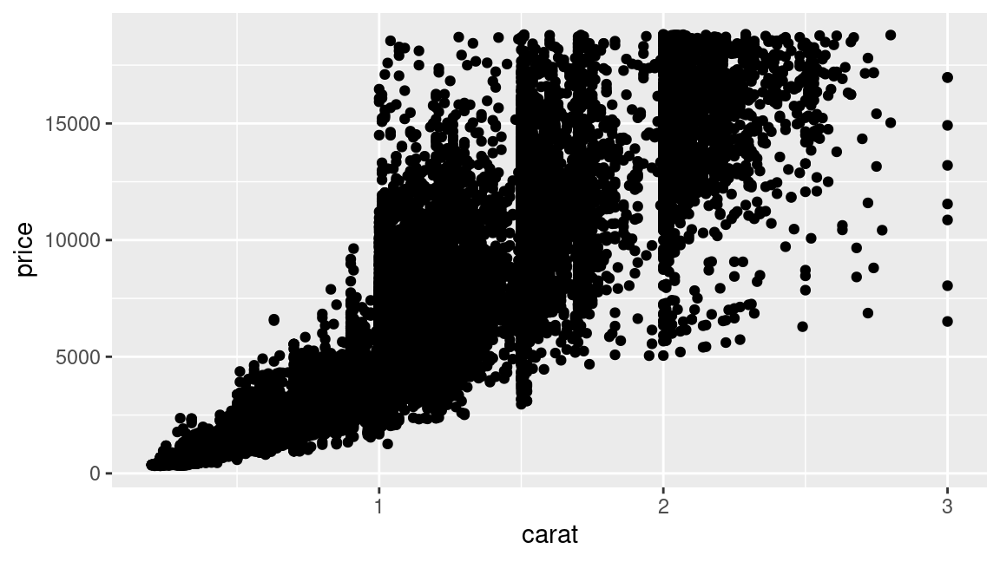
We are making good progress here! We can now see the points on the plot.
However, it does not quite look like the plot we set out to create. The
points in our original plot were colored based on the `clarity` of the
diamond. How do we incorporate this into our plot? Well, you might have
guessed it correctly already. We just need to add an additional
aesthetic mapping that maps the `color` aesthetic to the `clarity`
variable.

``` r
diamonds |> 
  ggplot() +
  aes(x = carat) +
  aes(y = price) +
  aes(color = clarity) +
  geom_point()
```

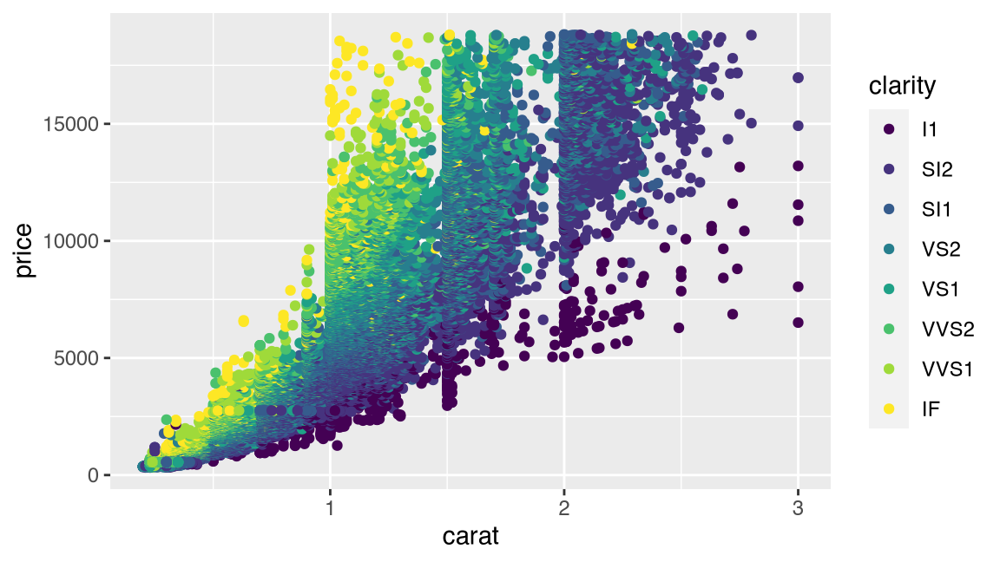

That looks much better now! We are almost there. The next visual element
we need to add are the lines. Each line is the line of best fit for a
specific value of `clarity`. If I did not know `ggplot2`, the way I
would have gone about adding this line to the plot is by building a
regression model of `price` vs. `carat` for each value of `clarity` and
then using the predicted values to get the line.

However, `ggplot2` make this really easy and has a geometry that is
perfect for this use case. We can add the lines without doing any
additional computation by using the `geom_smooth()` function, which fits
a curve to the points. We specify `method = "lm"` to force it to fit a
line. Note that we did not have to ask `geom_smooth()` to fit a separate
line for each value of `clarity`. This is because the aesthetic mappings
we added are global and every geometric layer that we add along the way
will respect this mapping.

``` r
diamonds |> 
  ggplot() +
  aes(x = carat) +
  aes(y = price) +
  aes(color = clarity) +
  geom_point() +
  geom_smooth(method = "lm")
#> `geom_smooth()` using formula = 'y ~ x'
```

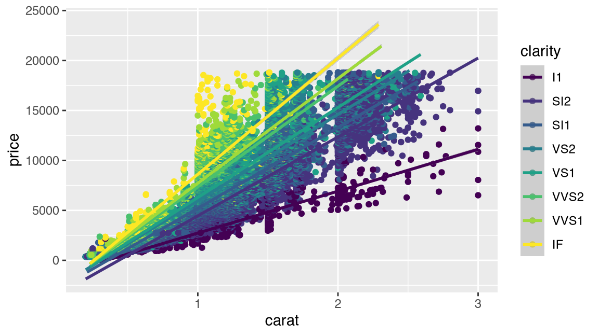

Finally, it is time to add labels to the plot. Labelling your plot
correctly is very important to creating good visualizations. Once again,
`ggplot2` makes it easy to add different labels using the `labs`
function. Lo and behold, we have composed our first visualization using
`ggplot2`.

``` r
diamonds |> 
  ggplot() +
  aes(x = carat) +
  aes(y = price) +
  aes(color = clarity) +
  geom_point() +
  geom_smooth(method = "lm") +
  labs(x = "Carat") +
  labs(y = "Price (in USD)") +
  labs(color = "Clarity") +
  labs(title = "Diamonds: Price vs. Carat by Clarity") +
  labs(subtitle = "Price per carat of diamonds increases with clarity") +
  labs(caption = "Source: Diamonds Dataset") +
  theme(plot.title.position = "plot")
#> `geom_smooth()` using formula = 'y ~ x'
```

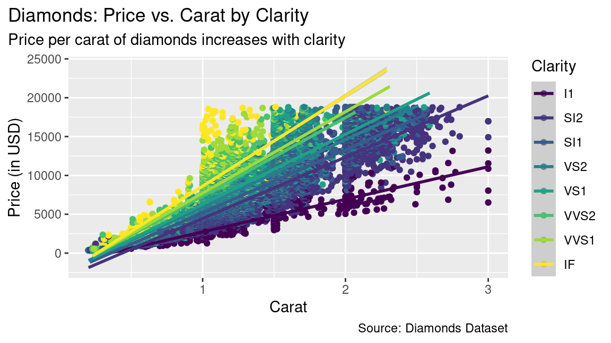

You might be thinking that this syntax is quite verbose to create plots
on a regular basis. And you wont be alone to think this way.
Fortunately, `ggplot2` does let you combine multiple lines of this code
to write this more concisely. It is customary in idiomatic ggplot2 code
to pull the aesthetic mappings into the `ggplot()` call.

``` r
diamonds |> 
  ggplot(aes(x = carat, y = price, color = clarity)) +
  geom_point() +
  geom_smooth(method = "lm") +
  labs(
    x = "Carat",
    y = "Price (in USD)",
    color = "Clarity",
    title = "Diamonds: Price vs. Carat by Clarity",
    subtitle = "Price per carat of diamonds increases with clarity",
    caption = "Source: Diamonds Dataset"
  ) +
  theme(plot.title.position = "plot")
```


Suppose, you wanted to add only ONE line of best fit to the plot rather
than the multiple lines. How would you modify the code above to
accomplish it? The trick is to recognize that every geometric layer
respects the aesthetic mappings that are global. If we want the points
to be colored by `clarity`, but NOT the line, then all we need to do is
to move the `color` mapping from the global layer into the geometry
specific layer.

``` r
diamonds |> 
  ggplot(aes(x = carat, y = price)) +
  geom_point(aes(color = clarity)) +
  geom_smooth(method = "lm") +
  labs(
    x = "Carat",
    y = "Price (in USD)",
    color = "Clarity",
    title = "Diamonds: Price vs. Carat by Clarity",
    subtitle = "Price per carat of diamonds increases with clarity",
    caption = "Source: Diamonds Dataset"
  ) +
  theme(plot.title.position = "plot")
#> `geom_smooth()` using formula = 'y ~ x'
```

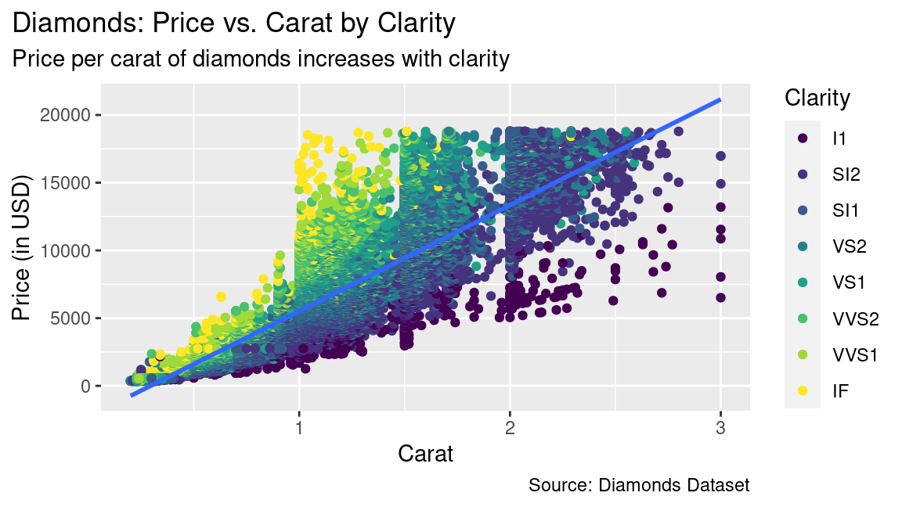

### Visualizing Variables

Let us explore how to use `ggplot2` to explore individual variables in a
dataset. Our approach to visualize an individual variable will depend on
whether it is numerical or categorical.

#### Numerical

A numerical variable is one that takes a wide range of values on the
number scale. These variables can usually be added, subtracted,
multiplied and divided. Additionally, they can be discrete or
continuous. In the `diamonds` dataset, there are several numerical
variables like `price`, `carat`, `x`, `y`, and `z`.

##### Histogram

The most common approach to visualizing a numerical variable is to
create a histogram. A histogram consists of a series of vertical bars,
where the height of each bar represents the frequency or count of data
points that fall within a specific range or bin.

Let us create a histogram of the distribution of price per carat of
diamonds.

``` r
# Start with the data
diamonds |> 
  # Create an empty plot
  ggplot() +
  # Map the `x` axis to price per carat
  aes(x = price / carat) +
  # Visualize as a histogram
  geom_histogram(color = 'white')
#> `stat_bin()` using `bins = 30`. Pick better value with `binwidth`.
```


We can write the code for the plot above more concisely by moving the
`aes` mapping inside the `ggplot()` call. This is the idiomatic way to
write `ggplot2` code and we will use it going forward.

``` r
diamonds |> 
  ggplot(aes(x = price / carat)) +
  geom_histogram(color = 'white')
#> `stat_bin()` using `bins = 30`. Pick better value with `binwidth`.
```


##### Density

An alternative to the histogram is a density plot. We can modify the
code used to generate our histogram and swap the `geom_histogram()`
function with `geom_density()` to create the density plot.

``` r
diamonds |> 
  ggplot(aes(x = price / carat)) +
  geom_density()
```

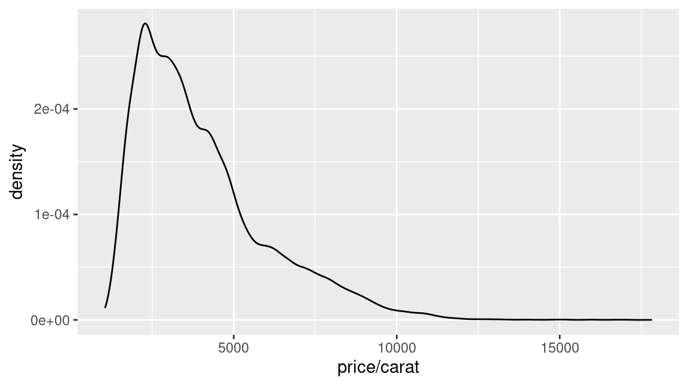

#### Categorical

A categorical variable usually takes on values from a small set of
values. In the `diamonds` dataset, the variables `cut`, `color`, and
`clarity` are categorical. The most common way to visualize a
categorical variable is by creating a bar plot, where the height of the
bars represent the frequency.

We can create a bar plot using `ggplot2` using the `geom_bar()`
function. Note that we did not have to explicitly compute and map the
`y` variable. This is because, the `geom_bar()` function automatically
handles it for us under the hood.

``` r
diamonds |> 
  ggplot(aes(x = clarity)) +
  geom_bar()
```

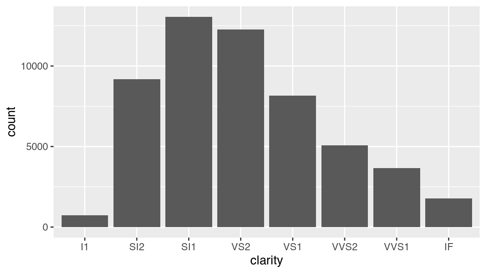

The above plot orders the colors in alphabetic order. But sometimes, it
is more useful to order the bars in increasing or decreasing order of
frequencies. This can be accomplished using the `fct_infreq()` function
from the `forcats` package. It reorders the variable `clarity` in
decreasing order of frequencies.

``` r
diamonds |> 
  ggplot(aes(x = fct_infreq(clarity))) +
  geom_bar()
```

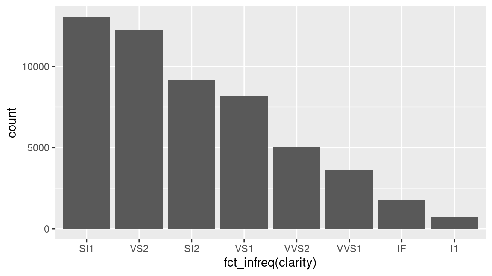

At times, it is advantageous to create horizontal bar plots, where the
categorical variables are on the `y` axis. Once again, `ggplot2` makes
this really easy and all you need to do is to swap out the mapping of
the `color` variable from `x` to `y`.

``` r
diamonds |> 
  ggplot(aes(y = fct_infreq(clarity))) +
  geom_bar()
```

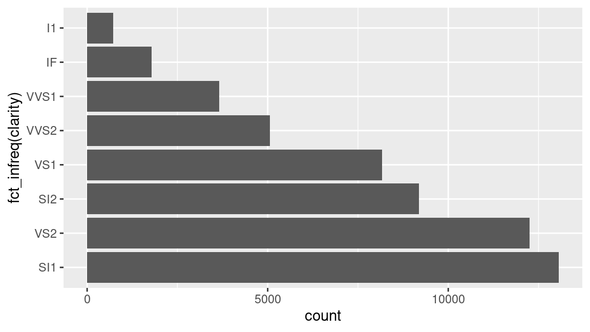

### Visualizing Relationships

#### Numerical vs. Numerical

##### Scatterplot

We can visualize the relationship between two numerical variables using
a scatterplot. This is accomplished in `ggplot2` by mapping the `x` and
`y` aesthetics to the appropriate numerical variables in the data, and
visualizing the mapping using `geom_point()`.

``` r
diamonds |> 
  ggplot(aes(x = carat, y = price)) +
  geom_point()
```

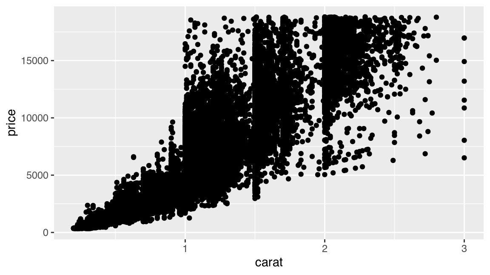

As you can see, there is a lot of overplotting going on here that makes
it hard to see where the points are concentrated. One way to reduce
overplotting is to specify an `alpha` to control the opacity of the
points.

``` r
diamonds |> 
  ggplot(aes(x = carat, y = price)) +
  geom_point(alpha = 0.1)
```

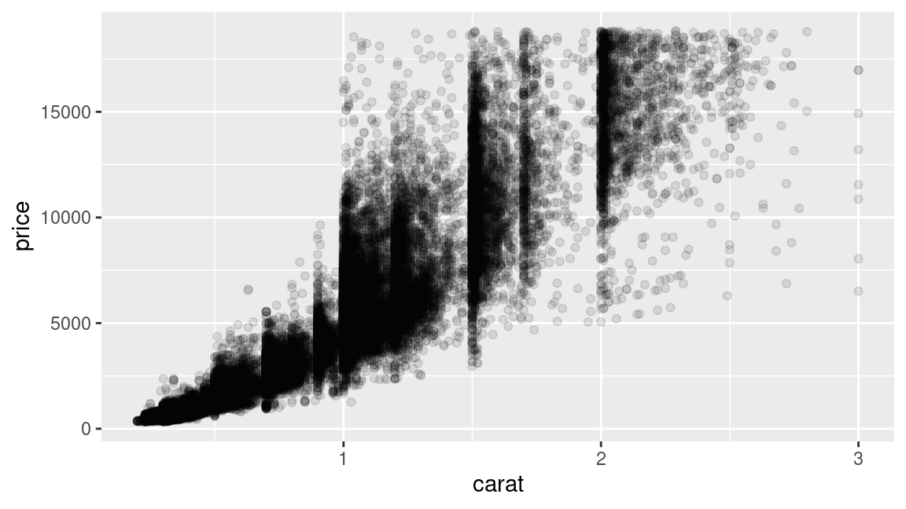

##### Hexplot

An alternative to scatterplots are hexagonal plots or hexbin plots. They
represent the distribution of two-dimensional data in a hexagonal grid.
Each hexagon in the grid represents a bin that contains a certain number
of data points. The color or shading of each bin corresponds to the
density of data points within it, with darker colors indicating higher
densities.

We can create a `hexbin` plot by simply swapping out the `geom_point()`
function with the `geom_hex()` function.

``` r
diamonds |> 
  ggplot(aes(x = carat, y = price)) +
  geom_hex()
```

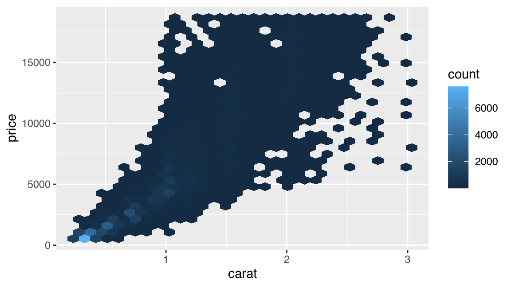

#### Categorical vs. Categorical

We can use stacked bar plots to visualize the relationship between two
categorical variables. For example, let us take a look at the joint
distribution of `clarity` and `color`. This stacked bar plot is the same
as a regular bar plot, except that each bar is further subdivided based
on the `color` of the diamond. This lets us understand the relationship
between categorical variables.

``` r
diamonds |> 
  ggplot(aes(x = clarity, fill = color)) +
  geom_bar()
```

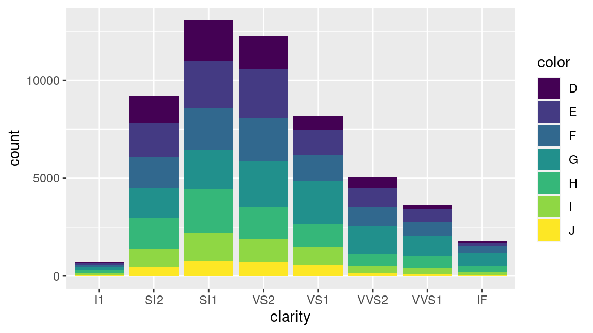

We can set the `position` argument to `fill` to stack all the bars to
100%. This allows us to explore how one categorical variable is
distributed with respect to the other.

``` r
diamonds |> 
  ggplot(aes(x = clarity, fill = color)) +
  geom_bar(position = "fill")
```

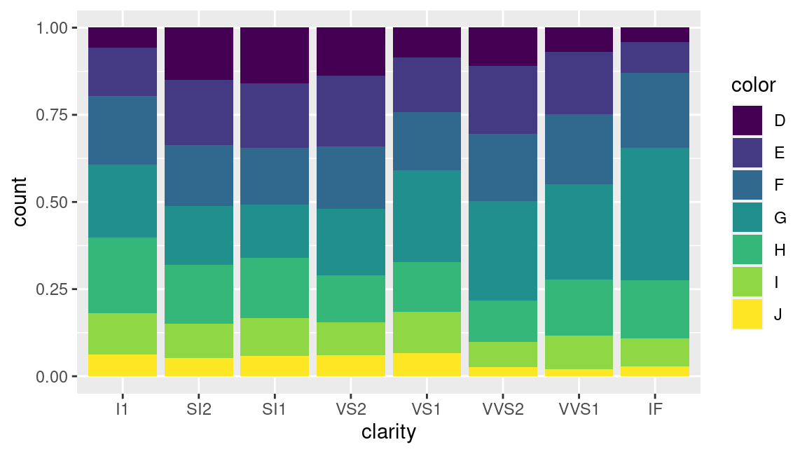

Finally, it is sometimes valuable NOT to stack the bars, but display
them side-by-side. We can accomplish this by setting `position` to
`dodge`.

``` r
diamonds |> 
  ggplot(aes(x = clarity, fill = color)) +
  geom_bar(position = "dodge")
```

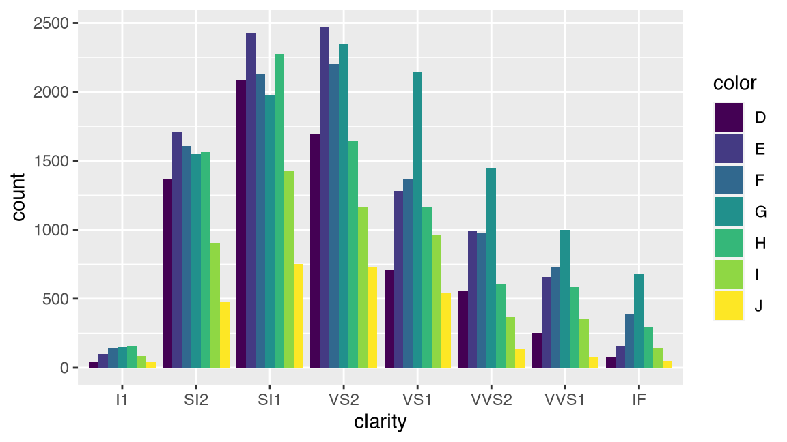

#### Numerical vs. Categorical

##### Boxplot

We can use a boxplot to visualize the relationship between a numerical
variable and a categorical variable. For example, let us look at how the
`price_per_carat` of a diamond varies with its `clarity`.

``` r
diamonds |> 
  ggplot(aes(x = clarity, y = price / carat)) +
  geom_boxplot()
```

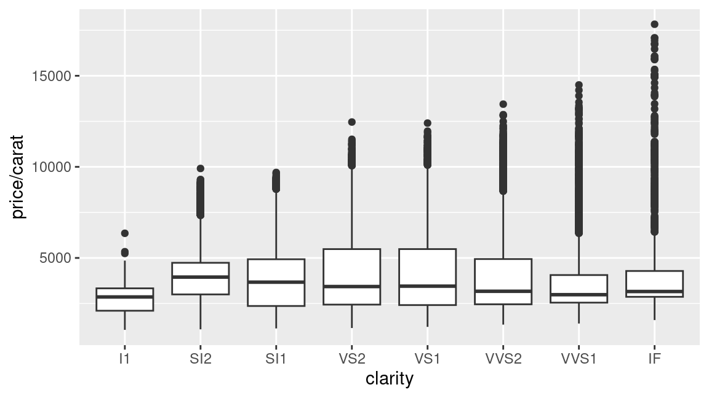

The boxplot summarizes the distribution of `price_per_carat` by
`clarity` in terms of its `median` (the thick line in the middle), its
25th and 75th percentiles (the box), and outlier observations (the
points). We can observe from the plot above that the `price_per_carat`
increases with `clarity` of the diamond. There is also huge variation in
`price_per_carat` for diamonds in the mid range of `clarity`.

We can reduce the overplotting in the outliers by setting the argument
`outlier.alpha` in the `geom_boxplot()` call.

``` r
diamonds |> 
  ggplot(aes(x = clarity, y = price / carat)) +
  geom_boxplot(outlier.alpha = 0.02)
```

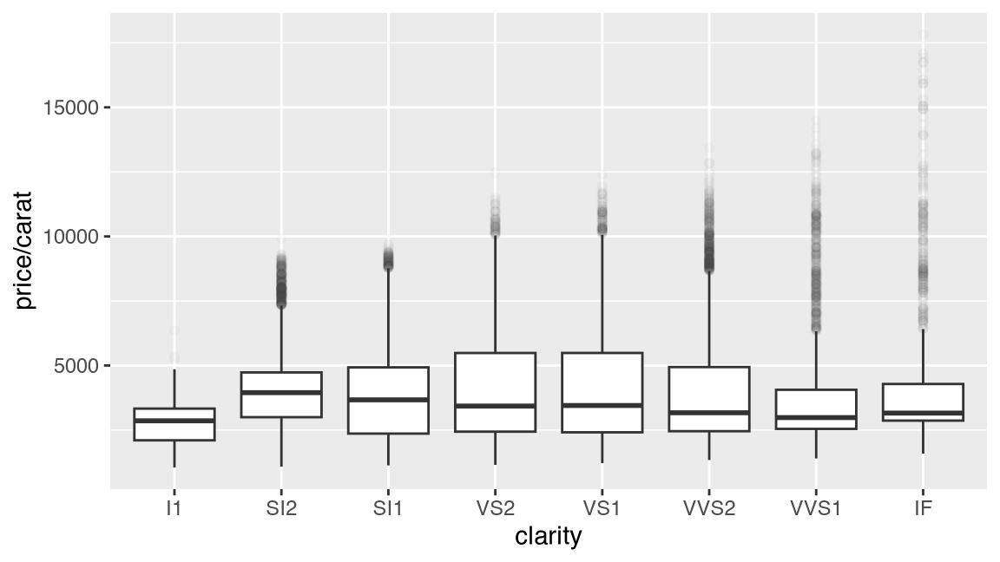

##### Violin

An interesting alternative to the boxplot is the violin plot.

``` r
diamonds |> 
  ggplot(aes(x = clarity, y = price / carat)) +
  geom_violin()
```

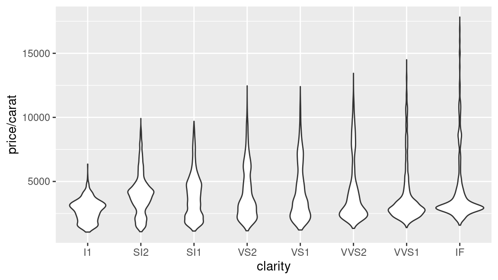

#### Multiple Variables

There are two approaches to explore the relationship between multiple
variables.

##### Aesthetics

The first is to map the additional variables to other aesthetics. For
example, if we want to understand the relationship between `price` and
`carat` for diamonds of different `clarity`, we can map `clarity` to the
`color` aesthetic.

``` r
diamonds |> 
  ggplot(aes(x = carat, y = price, color = clarity)) +
  geom_point()
```


If we want to visualize variation by `cut` of the diamond as well, we
can map an additional aesthetic `shape` to `cut`.

``` r
diamonds |> 
  ggplot(aes(x = carat, y = price, color = clarity, shape = cut)) +
  geom_point()
```

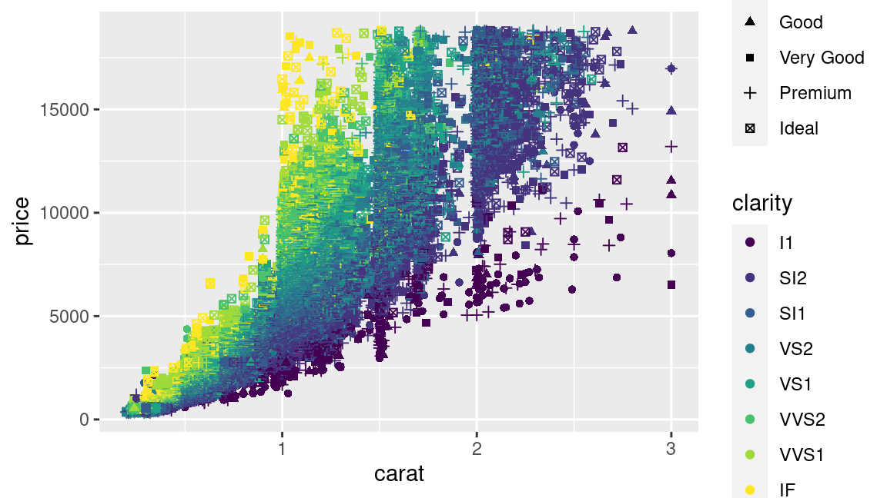

We will learn more about the different `aesthetics` supported by
`ggplot2()` in Week 2. While mapping additional aesthetics is a
convenient way to bring in additional variables, it can get really messy
very soon. Hence, we often resort to another technique to bring in
additional variables.

##### Facet

Facets are a really powerful way to visualize the relationship between
more than two variables. Rather than mapping the additional variables to
`aesthetics`, we split the plot into small multiples or panels. For
example, in the plot below, rather than mapping an additional aesthetic
for `cut`, we use `facet_wrap()` to split the plot into different panels
for each `cut`.

``` r
diamonds |> 
  ggplot(aes(x = carat, y = price, color = clarity)) +
  geom_point() +
  facet_wrap(~ cut)
```

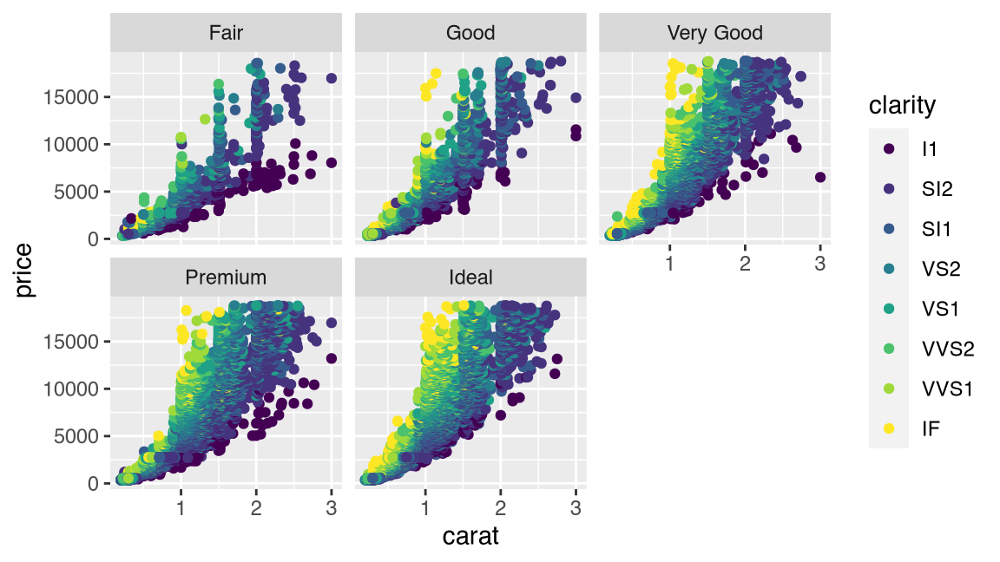

We are not restricted to splitting the panels based on a single
variable. We can split it into a grid based on a combination of
variables using the `facet_grid()` function.

``` r
diamonds |> 
  ggplot(aes(x = carat, y = price, color = clarity)) +
  geom_point() +
  facet_grid(color ~ cut) +
  theme_gray(base_size = 7)
```

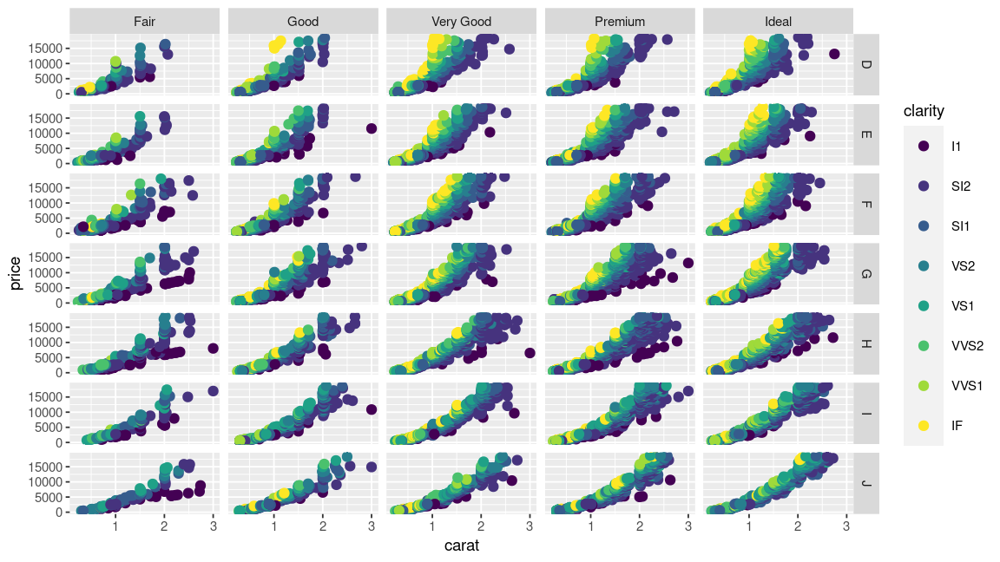

The `ggplot2` package provides a really powerful abstraction of the
grammar of graphics. We will dive deeper into this grammar in Week 2.


