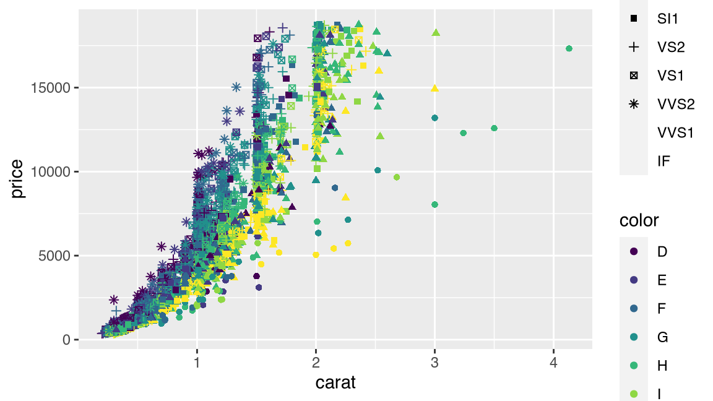
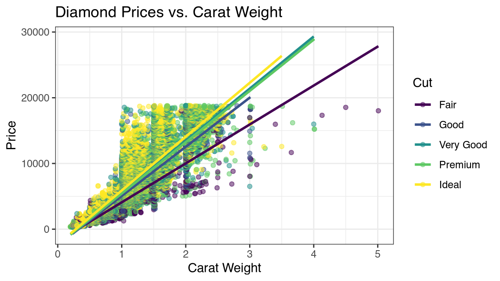
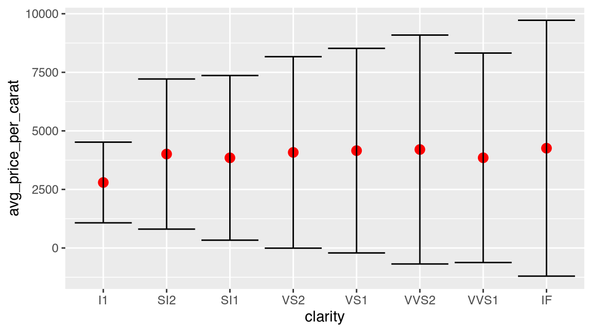
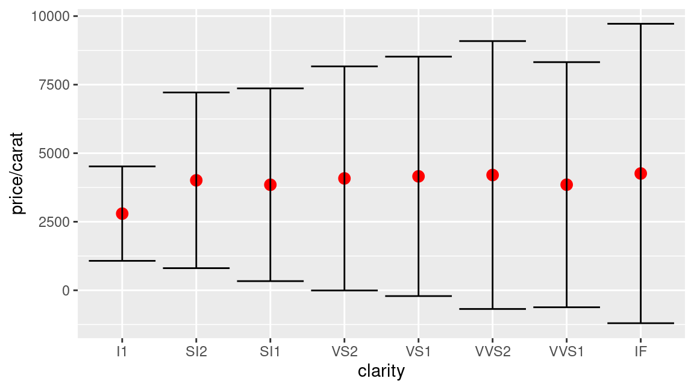
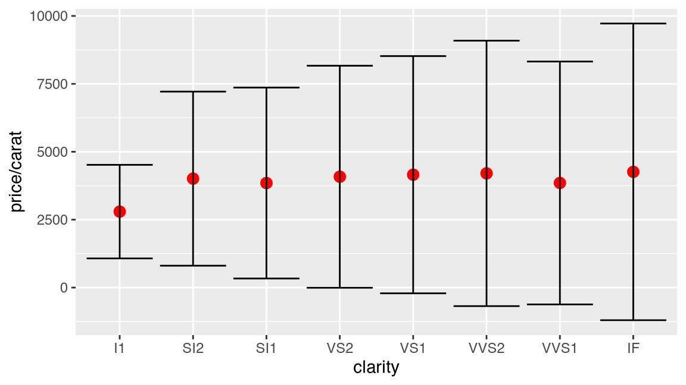
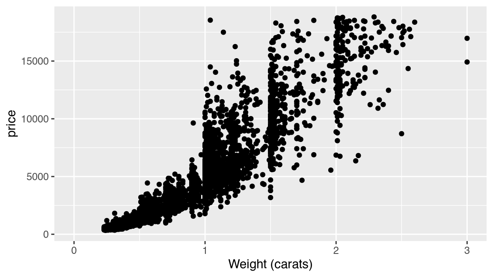
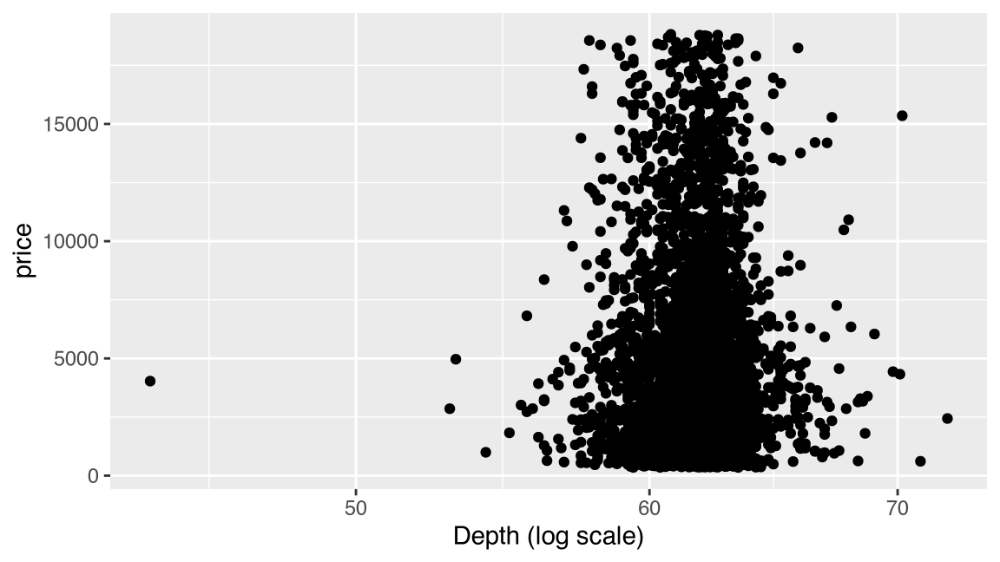
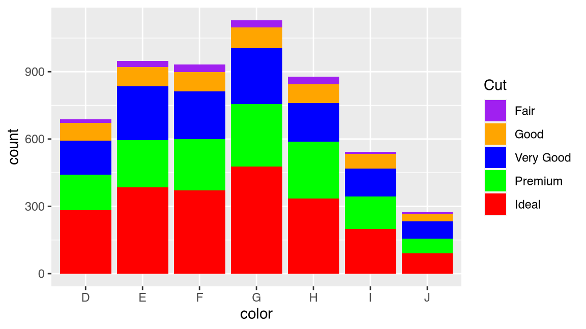
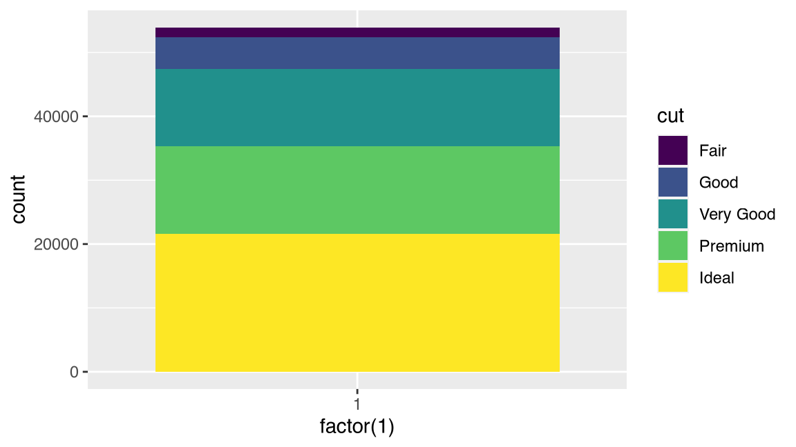
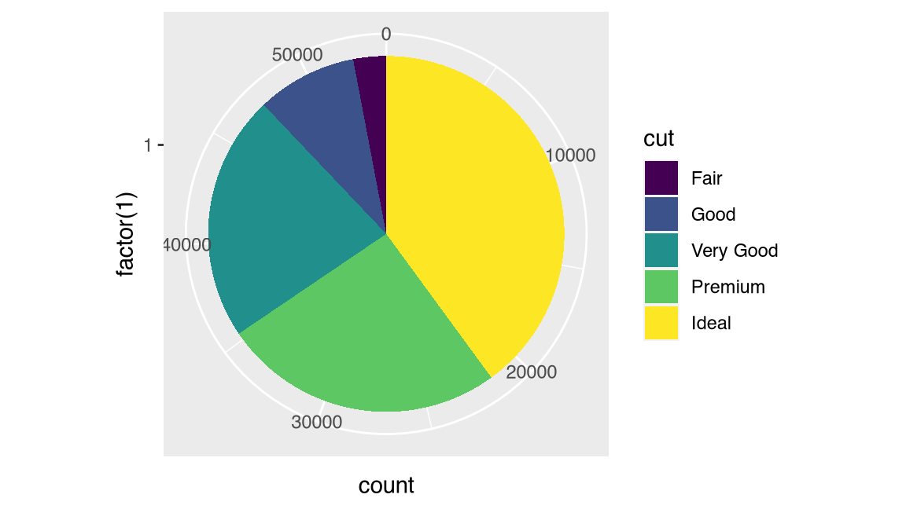

## Grammar of Graphics

The **Grammar of Graphics** is a framework for creating visualizations
that was introduced by Leland Wilkinson in his
[book](https://www.amazon.com/Grammar-Graphics-Statistics-Computing/dp/0387245448)
of the same name. It is based on the idea that a plot can be thought of
as a set of layers, each representing different components of the data.
The Grammar of Graphics provides a set of rules for how these layers
should be combined to create a coherent and informative visualization.


[`ggplot2`](https://ggplot2.tidyverse.org) is an R package that
implements the **Grammar of Graphics**. It provides a powerful and
flexible system for creating a wide variety of plots, including
scatterplots, line plots, bar charts, histograms, and more. The ggplot2
syntax is designed to be intuitive and easy to use, allowing users to
quickly create complex visualizations with just a few lines of code.

The key components of a `ggplot2` plot are the `data`, the `aesthetic`
mappings, the `layers` consisting of `geometric` objects and
`statistical` transformations, the `scales`, the `coordinates`, the
`facets` and `theme`.

- **Data** The set of observations being plotted.
- **Aesthetic** mappings specify how the data should be mapped to visual
  properties such as color, shape, and size.
- **Layers** represent the visual elements of the plot, such as points,
  lines, and bars.
- **Scales** control how the data is represented in the plot, such as
  the range of values for the axes.
- **Coordinates** map data into the plot panel
- **Facets** allow users to create multiple plots based on different
  subsets of the data.
- **Themes** control the overal visual defaults of the plot

Together, these components allow users to create a wide range of
visualizations that can be customized to their specific needs. The
ggplot2 syntax is designed to be intuitive and easy to use, allowing
users to quickly create complex visualizations with just a few lines of
code.

``` r
# Load packages and common utility functions
library(tidyverse)
source(here::here("_common.R"))
```

In this lesson, we will explore the grammar of graphics to understand
its true powers.

### Data

Tidy Data is the fundamental starting point of all data visualizations.
Note that in the real-world, datasets are almost always messy and it
takes a lot of effort to wrangle them and whip them into shape to
visualize them. We will use the tidy dataset `diamonds` that we used
previously.

``` r
diamonds
#> # A tibble: 53,940 × 10
#>    carat cut       color clarity depth table price     x     y     z
#>    <dbl> <ord>     <ord> <ord>   <dbl> <dbl> <int> <dbl> <dbl> <dbl>
#>  1  0.23 Ideal     E     SI2      61.5    55   326  3.95  3.98  2.43
#>  2  0.21 Premium   E     SI1      59.8    61   326  3.89  3.84  2.31
#>  3  0.23 Good      E     VS1      56.9    65   327  4.05  4.07  2.31
#>  4  0.29 Premium   I     VS2      62.4    58   334  4.2   4.23  2.63
#>  5  0.31 Good      J     SI2      63.3    58   335  4.34  4.35  2.75
#>  6  0.24 Very Good J     VVS2     62.8    57   336  3.94  3.96  2.48
#>  7  0.24 Very Good I     VVS1     62.3    57   336  3.95  3.98  2.47
#>  8  0.26 Very Good H     SI1      61.9    55   337  4.07  4.11  2.53
#>  9  0.22 Fair      E     VS2      65.1    61   337  3.87  3.78  2.49
#> 10  0.23 Very Good H     VS1      59.4    61   338  4     4.05  2.39
#> # ℹ 53,930 more rows
```

### Aesthetics

Aesthetics map columns in the data to visual properties on the plot.


Some of the most commonly supported aesthetic mappings are:

- `x` and `y` positions
- `color`: color of points, lines, and shapes
- `fill`: color of bars and areas
- `alpha`: transparency of points, lines, and shapes
- `shape`: shape of points
- `size`: size of points
- `linetype`: type of line
- `group`: grouping of data for certain geoms (lines / facets)
- `label`: text labels for points, bars, and lines

Let us create a scatterplot using four different aesthetic mappings.
Note that we are creating this plot only for illustrative purposes and
this is not a representation of best practice.

``` r
diamonds |> 
  # Randomly select 10% of the rows from the dataframe for this example
  sample_frac(0.10) |> 
  ggplot(aes(
    x = carat,
    y = price, 
    color = color,
    shape = clarity
  )) +
  geom_point()
```


Note that not all aesthetic mappings are applicable to every type of
plot, and some `geoms` may support additional aesthetic mappings not
listed here. The full list of aesthetic mappings can be found in the
ggplot2 documentation.

### Layers

Every plot is composed of **layers**. `ggplot2` allows you to compose a
plot by adding multiple graphical layers together. Layers are added to a
`ggplot` object using the `+` operator, and can include different types
of `geom` layers and `stat` transformations, as well as other graphical
elements such as **annotations**, **axis labels**, and **legends**.

Let us refresh our memory by replicating a scatterplot for the
`diamonds` dataset that we created earlier.

``` r
diamonds |>
  ggplot() +
  aes(x = carat, y = price, color = cut) +
  geom_point(alpha = 0.5) +
  geom_smooth(method = "lm", se = FALSE) +
  labs(
    title = "Diamond Prices vs. Carat Weight",
    x = "Carat Weight",
    y = "Price",
    color = "Cut"
  ) +
  theme_bw()
#> `geom_smooth()` using formula = 'y ~ x'
```



In this example, we first create a basic `ggplot` object using the
`diamonds` dataset, mapping the `carat` variable to the x-axis, the
`price` variable to the y-axis, and the `cut` variable to the color
aesthetic. We then add two layers to the plot using the `+` operator:

- The first layer is a `geom_point()` layer, which creates a scatter
  plot of the data points, with points colored by cut. We set
  `alpha = 0.5` to make the points slightly transparent.
- The second layer is a `geom_smooth()` layer, which adds a linear
  regression line to the plot, also colored by cut. We set
  `method = "lm"` to specify that we want to use a linear regression
  model to fit the line, and `se = FALSE` to remove the shading around
  the line.

We then add additional graphical elements to the plot using various
functions and options:

- The `labs()` function is used to set the plot title, axis labels, and
  legend title.
- The `theme_bw()` function is used to set the plot theme to a simple
  black-and-white style.

By combining different layers and graphical elements in this way, you
can create highly customizable and informative visualizations that
convey complex information in an intuitive and visually appealing
manner.

You can create layers using the `geometries` and `stats`.

#### Geometries

The `geom` layer is used to specify the type of geometric object that
you want to use to represent your data, such as points, lines, bars, or
polygons. The `geom` layer is added to a `ggplot` object to create a
plot that displays your data in a visual form.

Here are some examples using the `diamonds` dataset to demonstrate the
use of different `geom` layers:

``` r
# Scatter plot of price vs. carat, colored by cut
ggplot(diamonds, aes(x = carat, y = price, color = cut)) + 
  geom_point(alpha = 0.5)

# Line plot of price vs. carat, colored by clarity
ggplot(diamonds, aes(x = carat, y = price, color = clarity)) + 
  geom_line(size = 1)

# Bar plot of diamond count by cut, colored by clarity
ggplot(diamonds, aes(x = cut, fill = clarity)) + 
  geom_bar(position = "dodge")

# Box plot of price by cut, colored by clarity
ggplot(diamonds, aes(x = cut, y = price, fill = clarity)) + 
  geom_boxplot()
```

#### Statistics

Suppose you want to plot summary statistics of `price_per_carat` by
`clarity`. Rather than use a `boxplot`, you want to use an error bar
ranging from -2 standard deviations from the mean to +2 standard
deviations from the mean. You can create this plot by computing the
statistical summaries required and then using the `geom_point()` and
`geom_errorbar()` functions.

``` r
diamonds |> 
  # Group by clarity
  group_by(clarity) |> 
  # Summarize mean and standard deviation of price_per_carat
  summarize(
    avg_price_per_carat = mean(price/carat),
    sd_price_per_carat = sd(price/carat),
    .groups = "drop"
  ) |> 
  # Initialize ggplot of avg_price_per_carat vs. clarity
  ggplot(aes(
    x = clarity, 
    y = avg_price_per_carat
  )) +
  # Add a point layer
  geom_point(color = 'red', size = 3) +
  # Add an errorbar layer with ymin and ymax
  geom_errorbar(aes(
    ymin = avg_price_per_carat - 2 * sd_price_per_carat,
    ymax = avg_price_per_carat + 2 * sd_price_per_carat
  ))
```



Transforming the data prior to plotting always works for every plot.
However, `ggplot2` provides another mechanism to carry out statistical
transformations out of the box. You already saw it in action when you
used `geom_boxplot` and `geom_violin`. Both these functions
automatically carry out statistical transformations on the data before
plotting them.

`ggplot2` ships with several statistical transformations out of the box,
that allow you to create sophisticated statistical plots without having
to pre-compute values. In this example, we can use the simplest of stat
functions in `ggplot2`, `stat_summary`, which applies a user defined
function on the data before plotting it.

1.  First, we use `stat_summary` with the `mean()` function to get the
    avg price per carat and plot it using a `point` geometric object.

2.  Next, we use `stat_summary` with the `mean_sdl()` function to
    compute the avg price per carat, as well as plus/minus 2 standard
    deviations from it, and plot it using a an `errorbar` geometric
    object.

``` r
diamonds |> 
  # Initialize a plot of price/carat vs. clarity
  ggplot(aes(
    x = clarity, 
    y = price / carat
  )) +
  # Compute stat. summary, mean price/carat and display as point
  stat_summary(
    geom = "point",
    fun = mean,
    color = 'red',
    size = 3
  ) +
  # Compute stat. summary, mean_sdl price/carat and display as errorbar
  stat_summary(
    geom = "errorbar",
    fun.data = mean_sdl
  )
```



We can rewrite this code in terms of geometric objects directly and
passing the statistic as an argument. In other words, the `geom_***` and
`stat_***` functions can be used interchangeably. Every `geom` object
has a default `stat` and every `stat` has a default `geom` object.

``` r
diamonds |> 
  ggplot(aes(
    x = clarity, 
    y = price / carat
  )) +
  geom_point(
    stat = "summary",
    fun = mean,
    color = 'red',
    size = 3
  ) +
  geom_errorbar(
    stat = "summary",
    fun.data = mean_sdl
  )
```


Mastering the different **`geom`** and **`stat`** layer functions will
let you create sophisticated data visualizations with ease as you can
build your plot up layer by layer.

### Scales

**Scales** control how the data is represented in the plot. They are
responsible for mapping the range of the data onto the range of the
plot, such as the range of values for the axes or the color scale for a
`heatmap`.

Scales in `ggplot2` can be continuous or discrete. Continuous scales are
used for numerical data, such as the values on the `x` and `y` axes, and
can be further classified as either linear or logarithmic scales.
Discrete scales are used for categorical data, such as the labels on the
x and y axes, and can be further classified as either nominal or ordinal
scales.

In addition to the basic scales for `x` and `y` axes, ggplot2 provides
many other scales for controlling the appearance of a plot, such as
`color` scales, `fill` scales, and `size` scales. These scales allow
users to customize the visual appearance of their plot in a wide variety
of ways.

Here are some examples of using scales.

**Changing the axis labels and limits**

``` r
diamonds |> 
  sample_frac(0.10) |> 
  ggplot(aes(x = carat, y = price)) +
  geom_point() +
  scale_x_continuous(name = "Weight (carats)", limits = c(0, 3))
```



This code creates a scatterplot of diamond weight (carat) versus price
for the `diamonds` dataset. The `scale_x_continuous()` function is used
to change the label of the x-axis to “Weight (carats)” and set the
limits of the x-axis to range from 0 to 3.

**Using a logarithmic scale**

``` r
diamonds |> 
  sample_frac(0.10) |> 
  ggplot(aes(x = depth, y = price)) +
  geom_point() +
  scale_x_log10(name = "Depth (log scale)")
```



This code creates a scatterplot of diamond depth versus price for the
`diamonds` dataset. The `scale_x_log10()` function is used to change the
x-axis scale to a logarithmic scale with a base of 10. The label of the
x-axis is also changed to “Depth (log scale)”.

**Changing the color scale**

``` r
diamonds |> 
  sample_frac(0.10) |> 
  ggplot(aes(x = color, fill = cut)) +
  geom_bar() +
  scale_fill_manual(
    name = "Cut",
    values = c(
      "Ideal" = "red",
      "Premium" = "green",
      "Very Good" = "blue",
      "Good" = "orange",
      "Fair" = "purple"
    )
  )
```



### Facets

Faceting in `ggplot2` is a powerful tool for creating multi-panel plots,
allowing you to break down your data into smaller, more manageable
subsets based on one or more categorical variables. The `facet_wrap()`
and `facet_grid()` functions provide two different approaches to
creating faceted plots.

We already covered faceting in an earlier lesson. Feel free to type
`? facet_wrap` and `? facet_grid` to explore the different arguments
supported by these functions.

### Coordinates

Consider the following stacked bar plot of diamonds by `cut`.

``` r
diamonds |> 
  ggplot(aes(x = factor(1), fill = cut)) +
  geom_bar()
```



The coordinates default to the cartesian system (`coord_cartesian()`).
What if we wanted to display a pie chart instead of a bar chart? The
beauty of the grammar of graphics is that a pie chart is the same as a
bar chart, EXCEPT that it uses polar coordinates. So, all we need to do
to draw a pie chart is to take the same code, but add a `coord_polar()`
on top of it, and lo and behold, we have our amazing pie chart!

``` r
diamonds |> 
  ggplot(aes(x = factor(1), fill = cut)) +
  geom_bar() +
  coord_polar(theta = "y")
```



------------------------------------------------------------------------

Please not that this is not an invitation to draw pie charts. Pie charts
are NOT useful EXCEPT under a very limited set of conditions, so please
do not use them, unless you know what you are doing!)

------------------------------------------------------------------------

If you type `coord_` and hit the tab button, you can cycle through the
different coordinate transformations that are supported by `ggplot2`.
The mapping ones in particular are very useful for spatial
visualizations.

### Themes

Finally, **themes** control the overall visual defaults of the plot.
Themes make it easy to skin the plot based on a style guide. The
`ggplot2` package supports a small set of themes including
`theme_gray()`, which is the default. The `ggthemes` and `ggtech`
packages support several alternative themes.
