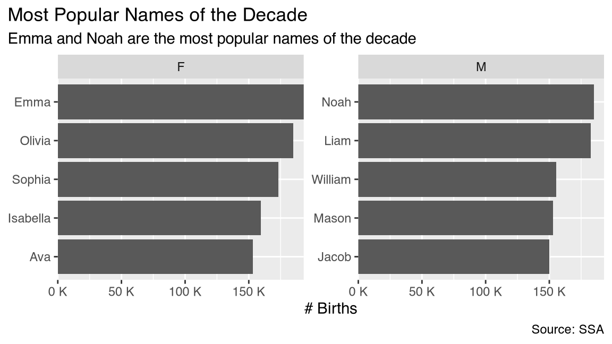
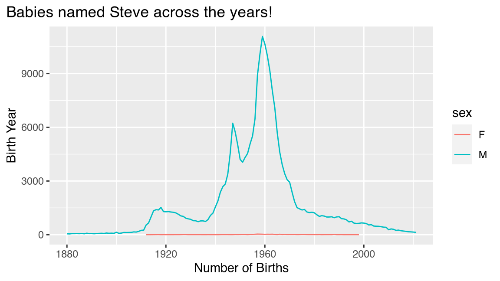
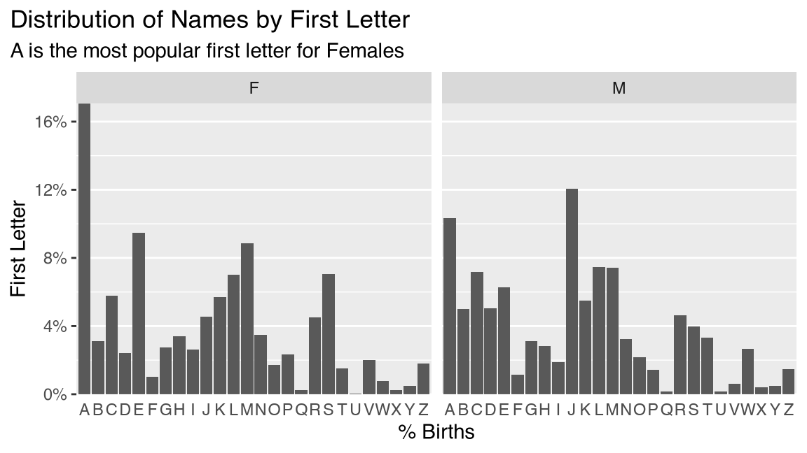
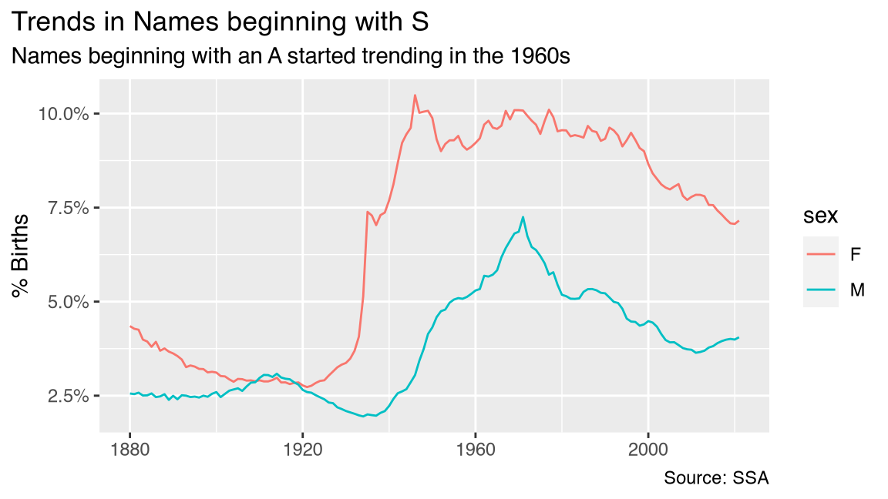
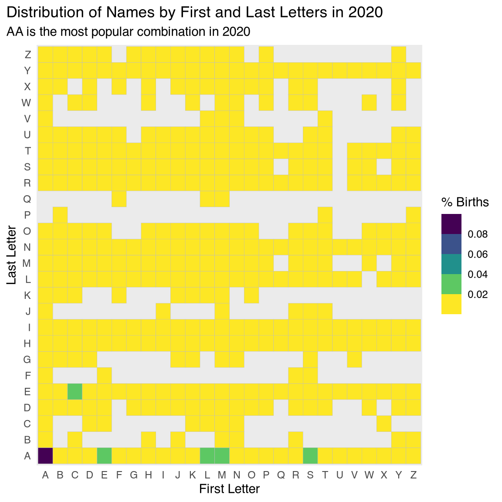
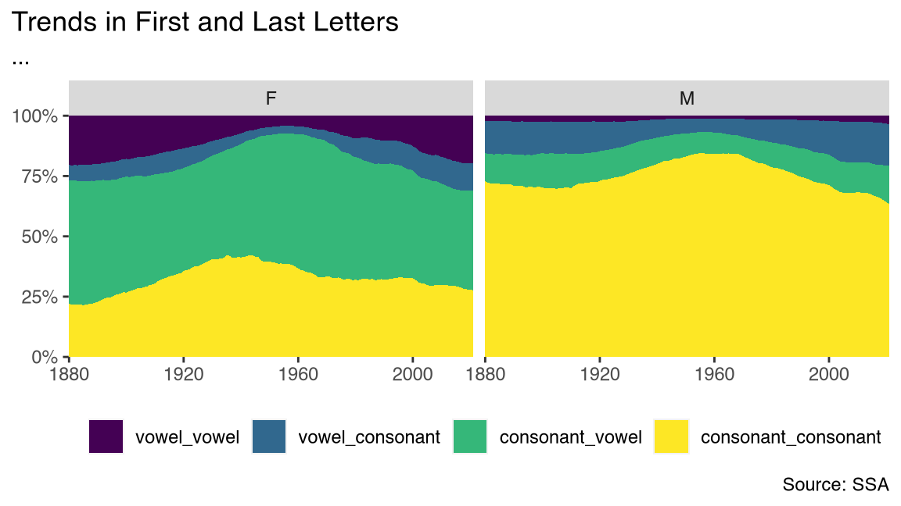

## Exploring 100+ Years of US Baby Names

In this project, we will explore 100+ years of US Baby Names. Although
this dataset only has 4 columns, there are so many interesting questions
one could explore. While the possibilities are endless, here are five
interesting questions for you to explore.

1.  Popular Names: What are the most popular names?
2.  Trendy Names: What are trendy names?
3.  Popular Letters: What are the most popular letters in names?
4.  Popular Letter Combinations: What are the most popular letter
    combinations?
5.  Vowels vs Consonants: Are there naming trends in usage of vowels and
    consonants?

You need to complete at least the first three questions. The last two
questions are optional.

### Import

Let us start by importing the data from `data/names.csv.gz`. You can use
the `read_csv` function from the `readr` package to do this.

``` r
# Load the tidyverse package
library(tidyverse)

# Read the csv file `file_name_names` as data frame `tbl_names`
file_name_names <- here::here("data/names.csv.gz")
tbl_names <- readr::read_csv(
  file = file_name_names, 
  show_col_types = FALSE
)

# Print `tbl_names`
tbl_names
```

    #> # A tibble: 2,052,781 × 4
    #>     year name      sex   nb_births
    #>    <dbl> <chr>     <chr>     <dbl>
    #>  1  1880 Mary      F          7065
    #>  2  1880 Anna      F          2604
    #>  3  1880 Emma      F          2003
    #>  4  1880 Elizabeth F          1939
    #>  5  1880 Minnie    F          1746
    #>  6  1880 Margaret  F          1578
    #>  7  1880 Ida       F          1472
    #>  8  1880 Alice     F          1414
    #>  9  1880 Bertha    F          1320
    #> 10  1880 Sarah     F          1288
    #> # ℹ 2,052,771 more rows

### Question 1: \[Popular Names\] What are the most popular names?

One of the first things we want to do is to understand naming trends.
Let us start by figuring out the top five most popular male and female
names for this decade (born 2011 and after, but before 2021). Do you
want to make any guesses?

#### Transform

The first step is always to transform the data into a form that is easy
to visualize. If we create a table with `sex`, `name` and `nb_births`
for the top 5 names for each `sex`, then we can turn it into a column
plot using `ggplot2`. Let us get the five most popular male and female
names of the decade starting in 2011.

``` r
tbl_names_popular = tbl_names |> 
  # Keep ROWS for year > 2010 and <= 2020
  filter(year > 2010, year <= 2020) |> 
  # Group by sex and name
  group_by(sex, name) |> 
  # Summarize the number of births
  summarize(
    nb_births = sum(nb_births),
    .groups = "drop"
  ) |> 
  # Group by sex 
  group_by(sex) |>  
  # For each sex, keep the top 5 rows by number of births
  slice_max(nb_births, n = 5)

tbl_names_popular
```

    #> # A tibble: 10 × 3
    #> # Groups:   sex [2]
    #>    sex   name     nb_births
    #>    <chr> <chr>        <dbl>
    #>  1 F     Emma        193138
    #>  2 F     Olivia      184966
    #>  3 F     Sophia      173341
    #>  4 F     Isabella    159570
    #>  5 F     Ava         153414
    #>  6 M     Noah        184977
    #>  7 M     Liam        182646
    #>  8 M     William     155326
    #>  9 M     Mason       152944
    #> 10 M     Jacob       150145

#### Visualize

Let us now visualize this data as a horizontal bar plot of number of
births by name faceted by sex.

Here, when thinking about how we might label this table, look back to
the statement of the question. Make sure to use this information in a
way so that the title, subtitle, and caption provide your reader with
concise, descriptive language so that viewers can quickly grasp the
plot’s purpose and findings.

``` r
tbl_names_popular |> 
  # Reorder the names by number of births
  mutate(name = fct_reorder(name, nb_births)) |>
  # Initialize a ggplot for name vs. nb_births
  ggplot(aes(x = nb_births, y = name)) +
  # Add a column plot layer
  geom_col() +
  # Facet the plots by sex
  facet_wrap(~ sex, scales = "free_y") +
  # Add labels (title, subtitle, caption, x, y)
  labs(
    title = 'Most Popular Names of the Decade',
    subtitle = 'Emma and Noah are the most popular names of the decade',
    caption = 'Source: SSA',
    x = '# Births',
    y = NULL
  ) +
  # Fix the x-axis scale 
  scale_x_continuous(
    labels = scales::unit_format(scale = 1e-3, unit = "K"),
    expand = c(0, 0),
  ) +
  # Move the plot title to top left
  theme(
    plot.title.position = 'plot'
  )
```



### Question 2: \[Trendy Names\] What are trendy names?

Consider the following two names `Elizabeth` and `Deneen`. `Elizabeth`
is a fairly stable name, while `Deneen` is not, when one looks at
trends. An interesting question to ask would be what are the top 5
stable and top 5 trendiest names. A stable name is one whose numbers
across years don’t vary drastically, while a trendy name is one whose
popularity peaks for a short period and then dies down.

There are many ways to capture trendiness. A simple measure would be to
look at the maximum number of births for a name, normalized by the sum
of of births across years. A trendy name would have a high value.

Let us use this idea to figure out the top 10 trendy names in this data
set. Let us use a cutoff of at least a 1000 births across all the years,
so we don’t pick up low-volume names. Feel free to experiment with this
threshold as you see fit.

#### Transform

We need to transform the data into a table that consists of the columns
`sex`, `name`, `nb_births_total`, `nb_births_max` and `trendiness`. We
compute `nb_births_total` as the total number of births across all
years, and `nb_births_max` as the maximum number of births for a given
name across all years. Finally, we compute trendiness as a ratio of
these two numbers. Follow the recipe outlined below to carry out the
transformation.

``` r
tbl_names_popular_trendy = tbl_names |> 
  # Group by sex and name
  group_by(sex, name) |> 
  # Summarize total number of births and max births in a year
  summarize(
    nb_births_total = sum(nb_births),
    nb_births_max = max(nb_births),
    .groups = "drop"
  ) |> 
  # Filter for names with at least 10000 births
  filter(nb_births_total > 1000) |> 
  # Add a column for trendiness computed as ratio of max to total
  mutate(trendiness = nb_births_max / nb_births_total) |> 
  # Group by sex
  group_by(sex) |> 
  # Slice top 5 rows by trendiness for each group
  slice_max(trendiness, n = 5)

tbl_names_popular_trendy
```

    #> # A tibble: 10 × 5
    #> # Groups:   sex [2]
    #>    sex   name     nb_births_total nb_births_max trendiness
    #>    <chr> <chr>              <dbl>         <dbl>      <dbl>
    #>  1 F     Kizzy               2346          1116      0.476
    #>  2 F     Wrenley             1310           622      0.475
    #>  3 F     Deneen              3603          1604      0.445
    #>  4 F     Moesha              1067           426      0.399
    #>  5 F     Mareli              1073           411      0.383
    #>  6 M     Christop            1082          1082      1    
    #>  7 M     Ermias              1319           521      0.395
    #>  8 M     Kanye               1358           509      0.375
    #>  9 M     Aziel               2686           971      0.362
    #> 10 M     Atreus              1234           432      0.350

|                                                                                                                                                                                                                                                                                                                                       |
|---------------------------------------------------------------------------------------------------------------------------------------------------------------------------------------------------------------------------------------------------------------------------------------------------------------------------------------|
| **Note**                                                                                                                                                                                                                                                                                                                              |
| There are always several different approaches to the same transformation. When it comes to learning, there’s no one-size-fits-all solution. One way to make your learning stick is by trying to solve a problem in different ways. Even if you don’t get to the final answer, you will learn a lot by exploring different approaches. |

#### Visualize

Let us write a function that will accept a name as an argument and
return a plot with trends in number of births. We can then use this
function to plot the trends for different names.

``` r
plot_trends_in_name <- function(my_name) {
  tbl_names |> 
    # Filter for name = my_name
    filter(name == my_name) |> 
    # Initialize a ggplot of `nb_births` vs. `year` colored by `sex`
    ggplot(aes(x = year, y = nb_births, color = sex)) +
    # Add a line layer
    geom_line() +
    # Add labels (title, x, y)
    labs(
      title = glue::glue("Babies named {my_name} across the years!"),
      x = 'Number of Births',
      y = 'Birth Year'
    ) +
    # Update plot theme
    theme(plot.title.position = "plot")
}
plot_trends_in_name("Steve")
```



### Question 3: \[Popular Letters\] What are the most popular letters in names?

Have you ever wondered why some letters seem to be more prevalent in
names than others? In this question, you will embark on a journey to
uncover the reasons behind the popularity of specific letters in names.
This investigation will lead you to interesting insights about how the
popularity of letters in names has changed over time and the potential
factors that have influenced these trends.

1.  How have the first and last letters in names changed over the years
    by sex?
2.  What are the trends in percentage of names with a given first or
    last letter across years.
3.  What are the most popular combinations of first and last letters?

#### Transform

Let us start by transforming the data and adding two columns, one for
`first_letter` and one for `last_letter`. You can use the `str_sub()`
function from the `stringr` package to do this.

``` r
tbl_names = tbl_names |> 
  # Add NEW column first_letter by extracting `first_letter` from name using `str_sub`
  mutate(first_letter = str_sub(name, 1, 1)) |>  
  # Add NEW column last_letter by extracting `last_letter` from name using `str_sub`
  mutate(last_letter = str_sub(name, -1, -1)) |> 
  # UPDATE column `last_letter` to upper case using `str_to_upper`
  mutate(last_letter = str_to_upper(last_letter))

tbl_names
```

    #> # A tibble: 2,052,781 × 6
    #>     year name      sex   nb_births first_letter last_letter
    #>    <dbl> <chr>     <chr>     <dbl> <chr>        <chr>      
    #>  1  1880 Mary      F          7065 M            Y          
    #>  2  1880 Anna      F          2604 A            A          
    #>  3  1880 Emma      F          2003 E            A          
    #>  4  1880 Elizabeth F          1939 E            H          
    #>  5  1880 Minnie    F          1746 M            E          
    #>  6  1880 Margaret  F          1578 M            T          
    #>  7  1880 Ida       F          1472 I            A          
    #>  8  1880 Alice     F          1414 A            E          
    #>  9  1880 Bertha    F          1320 B            A          
    #> 10  1880 Sarah     F          1288 S            H          
    #> # ℹ 2,052,771 more rows

Begin by computing the distribution of births across year and sex by
first letter of a name.

``` r
tbl_names_by_letter = tbl_names |> 
  # Group by year, sex and first_letter
  group_by(year, sex, first_letter) |> 
  # Summarize total number of births, drop the grouping
  summarize(nb_births = sum(nb_births), .groups = "drop") |> 
  # Group by year and sex
  group_by(year, sex) |> 
  # Add NEW column pct_births by dividing nb_births by sum(nb_births)
  mutate(pct_births = nb_births / sum(nb_births))
  
tbl_names_by_letter
```

    #> # A tibble: 7,313 × 5
    #> # Groups:   year, sex [284]
    #>     year sex   first_letter nb_births pct_births
    #>    <dbl> <chr> <chr>            <dbl>      <dbl>
    #>  1  1880 F     A                 9334     0.103 
    #>  2  1880 F     B                 3876     0.0426
    #>  3  1880 F     C                 5868     0.0645
    #>  4  1880 F     D                 2218     0.0244
    #>  5  1880 F     E                11444     0.126 
    #>  6  1880 F     F                 2957     0.0325
    #>  7  1880 F     G                 2463     0.0271
    #>  8  1880 F     H                 2743     0.0301
    #>  9  1880 F     I                 2480     0.0273
    #> 10  1880 F     J                 3800     0.0418
    #> # ℹ 7,303 more rows

#### Visualize

Visualize the distribution of births by first letter for the year 2020,
faceted by sex.

``` r
tbl_names_by_letter |> 
  # Filter for the year 2020
  filter(year == 2020) |> 
  # Initialize a ggplot of pct_births vs. first_letter
  ggplot(aes(x = first_letter, y = pct_births)) +
  # Add a column layer using `geom_col()`
  geom_col() +
  # Facet wrap plot by sex
  facet_wrap(~ sex) +
  # Add labels (title, x, y)
  labs(
    title = 'Distribution of Names by First Letter',
    subtitle = 'A is the most popular first letter for Females',
    x = '% Births',
    y = 'First Letter',
    
  ) +
  # Fix scales of y axis
  scale_y_continuous(
    expand = c(0, 0),
    labels = scales::percent_format(accuracy = 1L)
  ) +
  # Update plotting theme
  theme(
    plot.title.position = "plot",
    axis.ticks.x = element_blank(),
    panel.grid.major.x = element_blank()
  )
```



Write a function that plot trends in the percentage of births for all
names starting with a specific first letter.

``` r
plot_trends_in_letter <- function(my_letter) {
  tbl_names_by_letter |> 
    # Filter for first_letter = my_letter
    filter(first_letter == my_letter) |> 
    # Initialize a gpglot of pct_births vs. year colored by sex
    ggplot(aes(x = year, y = pct_births, color = sex)) +
    # Add a line layer
    geom_line() +
    # Add labels (title, subtitle, caption, x, y)
    labs(
      title = glue::glue("Trends in Names beginning with {my_letter}"),
      subtitle = "Names beginning with an A started trending in the 1960s",
      caption = "Source: SSA",
      x = NULL,
      y = '% Births'
    ) +
    # Update y-axis scales to display percentages
    scale_y_continuous(labels = scales::percent_format()) +
    # Update theme
    theme(plot.title.position = "plot")
}

plot_trends_in_letter("S")
```



|                                                                                                                                                                                                                                                                                         |
|-----------------------------------------------------------------------------------------------------------------------------------------------------------------------------------------------------------------------------------------------------------------------------------------|
| **Bonus**                                                                                                                                                                                                                                                                               |
| How do these plots change when you focus on the `last_letter` instead of the `first_letter`. Feel free to go back and change `first_letter` to `last_letter` and see what you find. Try to make an educated guess before you run the code, so you can see if your intuition matches up! |

### Question 4: \[Unveiling Letter Combinations\] What secrets do the most popular letter combinations hold?

Are you ready to explore the fascinating realm of letter combinations in
names? This question will guide you through the process of analyzing the
joint distribution of births by first and last letters. By examining
these intriguing patterns, you’ll be able to unveil the most popular
letter combinations and how they have evolved over the years.

#### Transform

``` r
tbl_names_by_first_and_last_letter = tbl_names |> 
  # Filter for sex = "F"
  filter(sex == "F") |> 
  # Group by `first_letter`, `last_letter`, and `year`
  group_by(first_letter, last_letter, year) |> 
  # Summarize total number of births
  summarize(
    nb_births = sum(nb_births), 
    .groups = 'drop'
  ) |> 
  # Group by `year`
  group_by(year) |> 
  # Add NEW column pct_births by dividing nb_births by sum(nb_births)
  mutate(pct_births = nb_births / sum(nb_births)) |> 
  # Ungroup data
  ungroup()

tbl_names_by_first_and_last_letter
```

    #> # A tibble: 43,579 × 5
    #>    first_letter last_letter  year nb_births pct_births
    #>    <chr>        <chr>       <dbl>     <dbl>      <dbl>
    #>  1 A            A            1880      4784     0.0526
    #>  2 A            A            1881      4966     0.0540
    #>  3 A            A            1882      5728     0.0531
    #>  4 A            A            1883      6051     0.0539
    #>  5 A            A            1884      7038     0.0546
    #>  6 A            A            1885      7203     0.0541
    #>  7 A            A            1886      7785     0.0539
    #>  8 A            A            1887      7814     0.0535
    #>  9 A            A            1888      9444     0.0529
    #> 10 A            A            1889      9365     0.0525
    #> # ℹ 43,569 more rows

#### Visualize

Now, you will visualize the distribution of `pct_births` by
`last_letter` and `first_letter` by plotting a heatmap of the percentage
of births by first letter and last letter for the year 2021.

``` r
tbl_names_by_first_and_last_letter |> 
  # Filter for the year 2021
  filter(year == 2021) |> 
  # Initialize a ggplot of last_letter vs. first_letter
  ggplot(aes(x = first_letter, y = last_letter)) +
  # Add a `geom_tile` layer with fill mapped to pct_births
  geom_tile(aes( fill = pct_births), color = 'gray') +
  # Add labels (title, subtitle, x, y, fill)
  labs(
    title="Distribution of Names by First and Last Letters in 2020",
    subtitle = 'AA is the most popular combination in 2020', 
    x = 'First Letter',
    y = 'Last Letter',
    fill = '% Births'
  ) +
  # Update fill scale to use Viridis colors
  scale_fill_viridis_b(direction = -1) +
  # Update plotting theme
  theme(
    plot.title.position = "plot",
    panel.grid = element_blank(),
    axis.ticks = element_blank()
  )
```



### Question 5: \[Vowels vs Consonants\] Are there naming trends in usage of vowels and consonants?

Do certain combinations of vowels and consonants tend to appear more
often in names? Are there any notable changes in these patterns over the
years? In this question, we’ll explore the fascinating world of vowel
and consonant usage in names across time. This can help us understand
how the structure of names has evolved and what factors may have
influenced these changes. By diving into these linguistic aspects,
you’ll gain a greater appreciation for the intricacies and diversity of
names in our dataset. Let’s dive in and uncover the trends in the usage
of vowels and consonants!

#### Transform

In this step, you will create a function to identify whether a letter is
a vowel or a consonant. Then, you will use this function to categorize
the first and last letters in names as either vowels or consonants.
After that, you will group the data by sex, year, and letter type (vowel
or consonant) to calculate the percentage of births for each combination
of first and last letter types.

``` r
get_letter_type <- function(letter) {
  VOWELS <- c("A", "E", "I", "O", "U")
  ifelse(letter %in% VOWELS, 'vowel', 'consonant')
}

tbl_names_vowel_consonant <- tbl_names |> 
  # Add NEW column named `first_letter_type`
  mutate(first_letter_type = get_letter_type(first_letter)) |> 
  # Add NEW column named `last_letter_type`
  mutate(last_letter_type = get_letter_type(last_letter)) |> 
  # Group by `sex`, `year`, `first_letter_type` and `last_letter_type`
  group_by(sex, year, first_letter_type, last_letter_type) |> 
  # Summarize the total number of births
  summarize(
    nb_births = sum(nb_births),
    .groups = "drop"
  ) |> 
  # Group by `sex` and` `year`
  group_by(sex, year) |> 
  # Add NEW column with `pct_births` calculated as `nb_births / sum(nb_births)`
  mutate(pct_births = nb_births / sum(nb_births)) |> 
  # Ungroup the data
  ungroup() |> 
  # Unite `first_letter_type` and `last_letter_type` into a NEW column named `first_last`
  unite(first_last, c(first_letter_type, last_letter_type))

tbl_names_vowel_consonant
```

    #> # A tibble: 1,136 × 5
    #>    sex    year first_last          nb_births pct_births
    #>    <chr> <dbl> <chr>                   <dbl>      <dbl>
    #>  1 F      1880 consonant_consonant     19988     0.220 
    #>  2 F      1880 consonant_vowel         46765     0.514 
    #>  3 F      1880 vowel_consonant          5708     0.0627
    #>  4 F      1880 vowel_vowel             18533     0.204 
    #>  5 F      1881 consonant_consonant     20069     0.218 
    #>  6 F      1881 consonant_vowel         47287     0.514 
    #>  7 F      1881 vowel_consonant          5669     0.0617
    #>  8 F      1881 vowel_vowel             18928     0.206 
    #>  9 F      1882 consonant_consonant     23561     0.218 
    #> 10 F      1882 consonant_vowel         55449     0.514 
    #> # ℹ 1,126 more rows

#### Visualize

Now, you will create a visualization to display the trends in the usage
of vowels and consonants in names over time. The visualization will show
the percentage of births by the combination of first and last letter
types, separately for each sex.

``` r
tbl_names_vowel_consonant |> 
  # Reorder `first_last` by th median `pct_births`
  mutate(first_last = fct_reorder(first_last, pct_births, median)) |>
  # Initialize a ggplot of `pct_births` vs. `year`
  ggplot(aes(x = year, y = pct_births)) +
  # Add an area layer with fill = first_last
  geom_area(aes(fill = first_last)) +
  # Facet wrap plot by `sex`
  facet_wrap(~ sex) +
  # Add labels (title, subtitle, caption, x, y)
  labs(
    title = "Trends in First and Last Letters",
    subtitle = '...',
    caption = 'Source: SSA',
    x = NULL,
    y = NULL,
    fill = "",
  ) +
  # Clean up x and y axis scales
  scale_x_continuous(
    expand = c(0, 0)
  ) +
  scale_y_continuous(
    expand = c(0, 0),
    labels = scales::percent_format()
  ) +
  # Use Viridis colors for fill
  scale_fill_viridis_d() +
  theme(
    plot.title.position = 'plot',
    legend.position = 'bottom'
  )
```



|                                                                                                                                                                                                                                                                                                                                                                                                                                                                                                                                                                                                   |
|---------------------------------------------------------------------------------------------------------------------------------------------------------------------------------------------------------------------------------------------------------------------------------------------------------------------------------------------------------------------------------------------------------------------------------------------------------------------------------------------------------------------------------------------------------------------------------------------------|
| **Note**                                                                                                                                                                                                                                                                                                                                                                                                                                                                                                                                                                                          |
| The fct_reorder() function is a useful tool for reordering the levels of a factor based on the values of another variable. This function can be particularly helpful when creating visualizations, as it allows you to display data in a more organized and informative manner. In this exercise, fct_reorder() is used to reorder the levels of the first_last factor according to the median of the pct_births variable. By doing so, the resulting plot will show the trends in vowels and consonants usage in a more structured way, making it easier to identify and interpret the patterns. |

## MORE BONUS

You can turn your plots into a beautiful dashboard with minimal effort.
An Rmarkdown dashboard template has been provided for you. Open the file
[project-01-explore-babynames-flexdashboard.Rmd](project-01-explore-babynames-flexdashboard.Rmd).
It has placeholders for code, where you can paste the completed code
chunks from this document. Pay close attention to the labels of the
chunks referred to.
