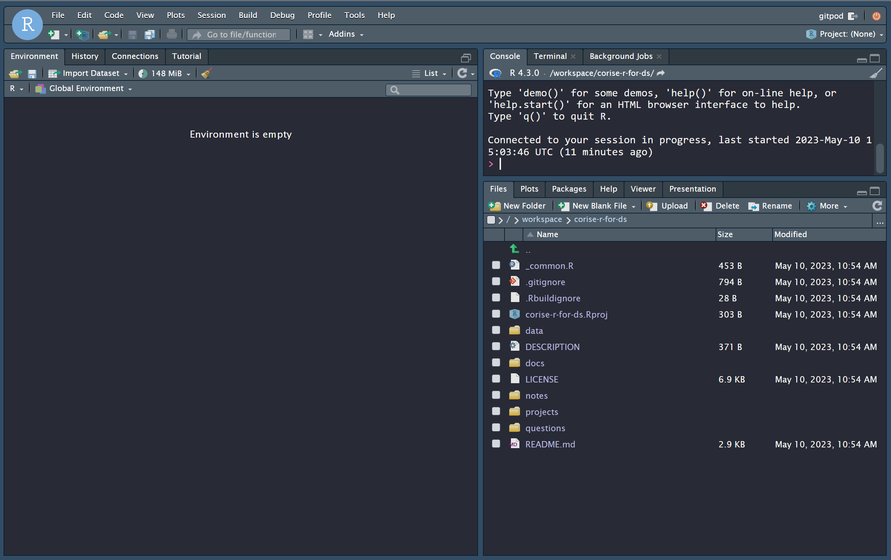
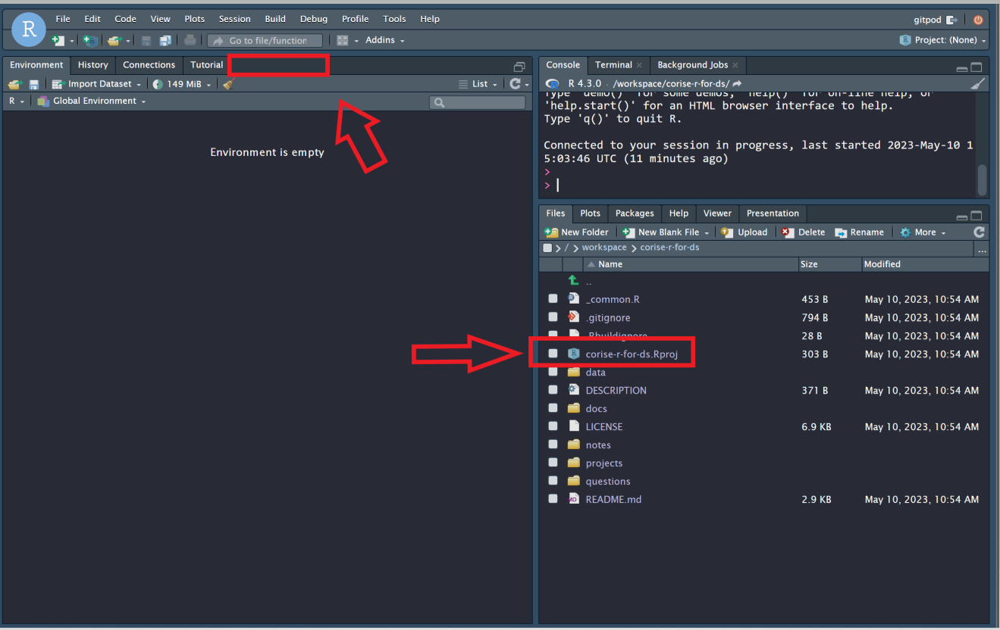
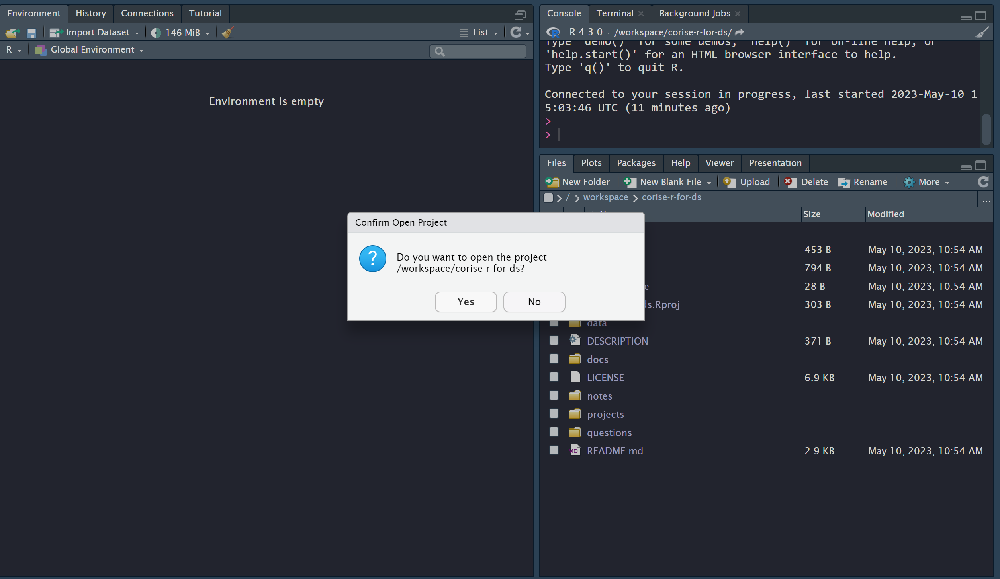

## Some additional help for getting GitPod working

Following the directions in the "GitPod Setup for Projects" post in the introduction module on CoRise, and after completing Part 3, your screen should resemble something like this:

If it is your first time opening the project, and you do not not see the word "Git" where I have an empty red rectangle on the left hand side of the screen, click on `corise-r-for-ds.Rproj`, click "Yes" when the prompt comes up, and then the project will appear afterwards.

In this area, we will do all of our coding work for the course. For example, this is what will appear when we click on project-01-explore-babynames.Rmd.

### To help with your viewing experience:

In this screenshot, if you click on this button in the upper right hand corner, this will help put R Studio in full screen mode.

These red rectangles can help adjust the size of the windows on your screen. Additionally, you can click and drag on the bars between the windows to adjust their size.

